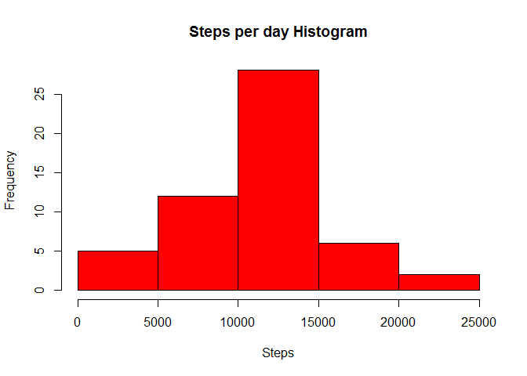
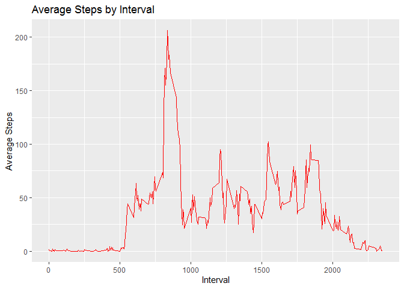
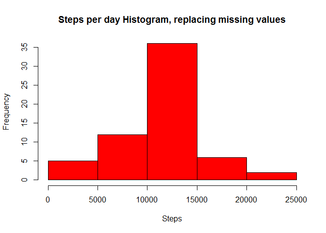
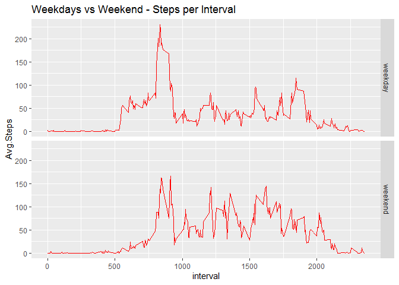

## Loading and preprocessing the data

```r
library(dplyr)
```

```
## 
## Attaching package: 'dplyr'
```

```
## The following objects are masked from 'package:stats':
## 
##     filter, lag
```

```
## The following objects are masked from 'package:base':
## 
##     intersect, setdiff, setequal, union
```

```r
library(ggplot2)
```

```
## Warning: package 'ggplot2' was built under R version 3.6.3
```

```r
library(lubridate)
```

```
## Warning: package 'lubridate' was built under R version 3.6.3
```

```
## 
## Attaching package: 'lubridate'
```

```
## The following objects are masked from 'package:dplyr':
## 
##     intersect, setdiff, union
```

```
## The following objects are masked from 'package:base':
## 
##     date, intersect, setdiff, union
```

```r
data <- read.csv("activity.csv")
data$date <- as.Date(data$date)
stepsperday <- data %>% group_by(date) %>% summarise(sum(steps))
names(stepsperday) <- c("date","spd")
dataclean <- data[!is.na(data$steps),]
```


## What is mean total number of steps taken per day?

```r
hist(stepsperday$spd,main = "Steps per day Histogram",xlab = "Steps",col = "red")
```

<!-- -->

```r
meanmedian <- summary(stepsperday$spd)[3:4]
meanmedian
```

```
##   Median     Mean 
## 10765.00 10766.19
```

Mean steps per day   = **1.0766189\times 10^{4}**.  

Median steps per day = **1.0765\times 10^{4}**.

## What is the average daily activity pattern?

The following analysis will show which intervals have the most activity.   The interval with the most activity will also be defined.


```r
averageinterval <- dataclean %>% group_by(interval) %>% summarise(mean(steps))
names(averageinterval) <- c("interval","Avg.Steps")
ggplot(averageinterval,aes(interval,Avg.Steps)) + geom_line(col = "red") + labs(title = "Average Steps by Interval",x = "Interval",y="Average Steps")
```

<!-- -->

```r
maxsteps <- which.max(averageinterval$Avg.Steps)
maxinterval <- averageinterval[maxsteps,1]
maxinterval
```

```
## # A tibble: 1 x 1
##   interval
##      <int>
## 1      835
```

The interval that contains the maximum number of steps, is interval **835**.


## Imputing missing values

The missing values are replaced with the Mean value of the corresponding interval.  The Mean of each value has been calculated in the previous step.  


```r
newdata <- left_join(data,averageinterval,by = "interval")
newdata <- newdata %>% mutate(steps2 = ifelse(is.na(steps),Avg.Steps,steps))
sum(is.na(data$steps))
```

```
## [1] 2304
```

```r
newdata <- select(newdata,steps2,date,interval)
stepsperday2 <- newdata %>% group_by(date) %>% summarise(sum(steps2))
names(stepsperday2) <- c("date","spd")
summary(stepsperday2$spd)[3:4]
```

```
##   Median     Mean 
## 10766.19 10766.19
```

```r
hist(stepsperday2$spd,main = "Steps per day Histogram, replacing missing values",xlab = "Steps",col = "red")
```

<!-- -->

With the imputing strategy used, the Mean has remained the same, **but the Median has gone up**.   The histogram shows a larger frequency of days with steps between 10000 and 15000.   This makes sense with the increase of the Median that is observed.


## Are there differences in activity patterns between weekdays and weekends?

This analysis will show us if there is more activity on a weekday or on the weekend.


```r
week <- newdata
week$weekday <- wday(week$date)
week <- week %>% mutate(typeday = ifelse(weekday == "1" | weekday =="7","weekend","weekday"))
week$typeday <- as.factor(week$typeday)
weekspd <- week %>% group_by(interval,typeday) %>% summarize(mean(steps2))
names(weekspd) <- c("interval","typeday","Avg.Steps")
ggplot(weekspd,aes(interval,Avg.Steps)) + geom_line(col = "red") + facet_grid("typeday") + labs(title = "Weekdays vs Weekend - Steps per Interval")
```

<!-- -->

The plot shows us that there is **more activity during weekdays**.  
